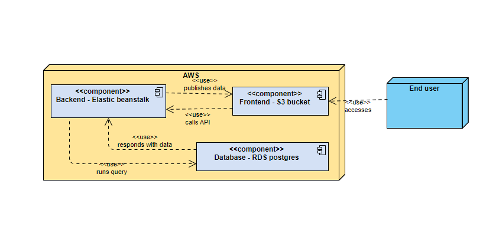

# Project deployment infrastructure

The project uses Amazon Web Services (AWS) as a platform for deployment. The application can be accessed through [this link](http://eu-schmiczy-udagram-frontend.s3.amazonaws.com/index.html).

## Services

The following figure illustrates the AWS services that are used for the project and their connections to each other.

### S3 bucket

The S3 bucket hosts the frontend of the application. End users interact with it from the public internet.

### Elastic Beanstalk environment

The EB environment hosts the backend of the application. The frontend calls it through its API to fetch data.

### RDS Postgres database

RDS hosts the Postgres database of the application. The backend runs queries on it.
