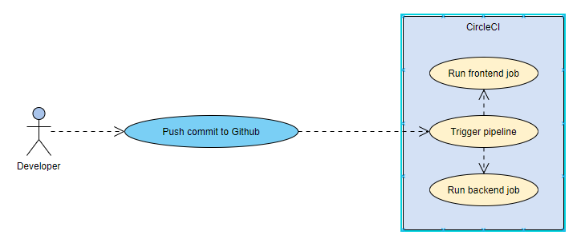
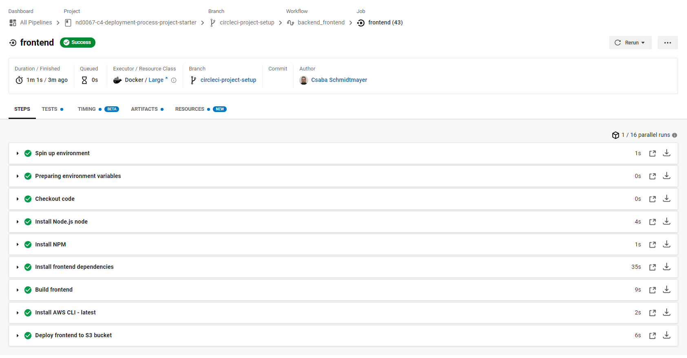
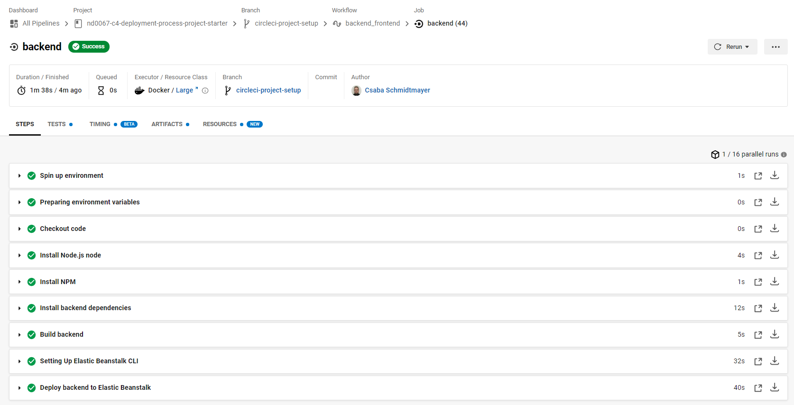

# Project CD pipeline

The project uses CircleCI to automatically deploy the application to AWS whenever a commit is pushed to the Github repository.

The following figure shows a high-level overview of the pipeline.

## Workflow

The workflow includes to jobs that are run concurrently:
  - `frontend`
  - `backend`

### Frontend job

The frontend job builds the frontend of the application and uploads the files to an AWS S3 bucket. The following figure illustrates the steps to perform the job:

### Backend job

The backend job builds the backend of the application and deploys it AWS Elastic Beanstalk. The following figure illustrates the steps to perform the job:

